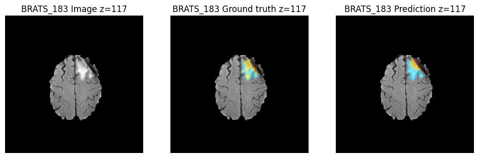
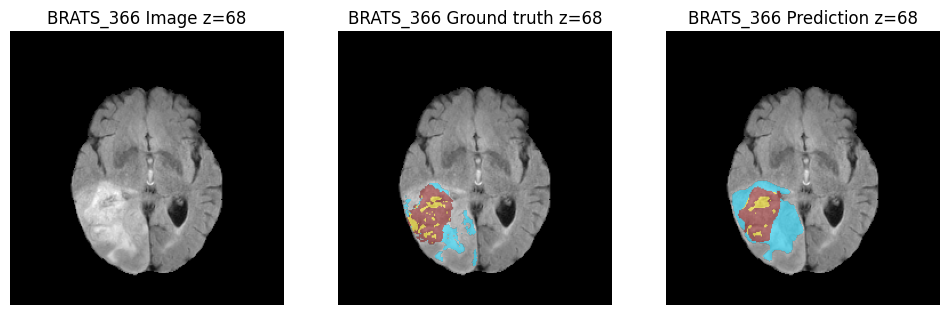
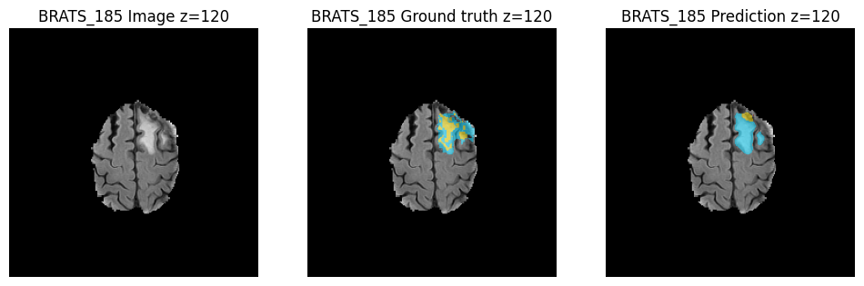
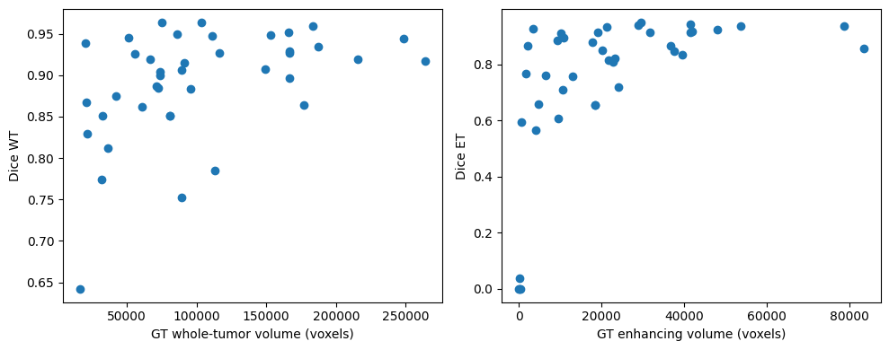
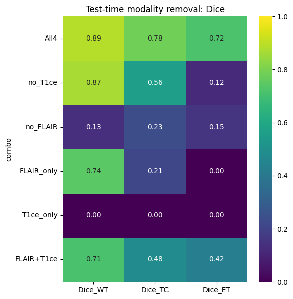
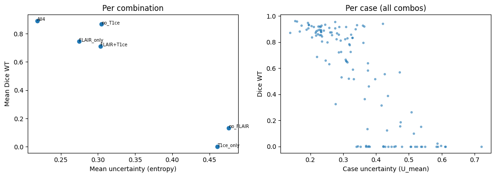
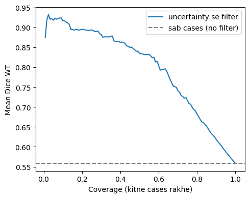

# 🧠 Brain Tumor Segmentation under Missing MRI Modalities

How robust is a state-of-the-art 3D segmentation network when one or more MRI sequences are **missing at test time**, and can its **predictive uncertainty** tell us when the segmentation can't be trusted?

This project trains an [nnU-Net v2](https://github.com/MIC-DKFZ/nnUNet) (`3d_fullres`) on multimodal brain MRI, then systematically removes input modalities at inference and measures (1) the drop in segmentation quality and (2) whether voxel-wise entropy can flag the failures.

---

## 📌 Key Findings

| Finding | Result |
|---|---|
| Baseline (all 4 modalities), 40 held-out cases | **Dice WT 0.890 · TC 0.801 · ET 0.744** |
| Removing **T1ce** | WT barely changes (0.889 → 0.868) but **ET collapses (0.717 → 0.118)** |
| Removing **FLAIR** | Catastrophic failure for every region (WT 0.889 → 0.134) |
| Uncertainty ↔ quality (pooled) | **Spearman ρ = −0.81** between mean entropy and Dice WT |
| Detecting bad segmentations (Dice WT < 0.7) | **AUROC = 0.933** using mean entropy |

> The model leans very heavily on **FLAIR** for whole-tumor delineation and on **T1ce** for the enhancing tumor, and mean-entropy uncertainty is a strong signal for when a prediction is unreliable.

---

## 🗂️ Dataset

- **Medical Segmentation Decathlon – Task01 BrainTumour** (multimodal brain MRI, BraTS-derived)
- 4 input channels: `FLAIR`, `T1w`, `T1gd (T1ce)`, `T2w`
- Labels: `1` edema, `2` non-enhancing tumor, `3` enhancing tumor
- Evaluation regions:
  - **WT** (Whole Tumor) = labels 1, 2, 3
  - **TC** (Tumor Core) = labels 2, 3
  - **ET** (Enhancing Tumor) = label 3

**Split (seed = 42):** 40 cases held out for testing, 150 cases used for nnU-Net training (5-fold setup, fold 0), the remaining cases are unused to keep Colab training time manageable.

---

## ⚙️ Method

1. **Training** – nnU-Net v2, `3d_fullres`, fold 0, custom trainer `nnUNetTrainer_15epochs` (15 epochs, checkpoint every epoch). Note: this is a short, compute-limited schedule, so absolute numbers are below a fully trained nnU-Net.
2. **Baseline evaluation** – predictions on the 40 held-out cases with softmax probabilities saved. Metrics: Dice and HD95 (computed with voxel spacing) per region.
3. **Test-time modality removal** – for 20 held-out cases, each missing channel is replaced by an all-zero volume (via symlinks). Six input combinations are tested:

   `All4` · `no_T1ce` · `no_FLAIR` · `FLAIR_only` · `T1ce_only` · `FLAIR+T1ce`

   (No retraining, no modality dropout, the same trained model is evaluated on corrupted inputs.)
4. **Uncertainty** – voxel-wise predictive **entropy** from the softmax output, aggregated over candidate voxels (background probability < 0.95):
   - `U_mean` – mean entropy
   - `U_sum` – summed entropy
5. **Reliability analysis** – Spearman correlation, AUROC for failure detection, and a risk–coverage curve.

---

## 📊 Results

### 1. Baseline performance (40 held-out cases, All-4 modalities)

| Region | Dice (mean ± std) | HD95 mm (mean ± std) |
|---|---|---|
| Whole Tumor (WT) | 0.890 ± 0.066 | 7.92 ± 7.86 |
| Tumor Core (TC) | 0.801 ± 0.171 | 9.24 ± 8.59 |
| Enhancing Tumor (ET) | 0.744 ± 0.270 | 4.89 ± 7.24 |

Mean entropy `U_mean` = 0.219 ± 0.044.

### 2. Qualitative examples (3 lowest-Dice cases)

Each panel: input image · ground truth · prediction.





### 3. Where does the model fail?

Failures are concentrated in cases with **small tumors** (small whole-tumor / enhancing volume), where a few misclassified voxels cost a lot of Dice.



### 4. Effect of missing modalities

Mean Dice over 20 cases per combination:

| Input combination | Dice WT | Dice TC | Dice ET | Mean entropy |
|---|---|---|---|---|
| All4 | **0.889** | **0.781** | **0.717** | 0.218 |
| no_T1ce | 0.868 | 0.556 | 0.118 | 0.305 |
| no_FLAIR | 0.134 | 0.231 | 0.154 | 0.476 |
| FLAIR_only | 0.745 | 0.213 | 0.004 | 0.275 |
| T1ce_only | 0.002 | 0.001 | 0.001 | 0.461 |
| FLAIR+T1ce | 0.712 | 0.480 | 0.423 | 0.304 |



**Takeaways**
- **FLAIR is critical.** Without it the model fails across all regions, and `T1ce_only` is essentially useless.
- **T1ce is critical for the enhancing tumor.** Whole-tumor segmentation survives its removal, but ET Dice drops from 0.72 to 0.12.
- Two modalities (`FLAIR+T1ce`) already recover much of the performance, but the model was never trained for this scenario.

### 5. Does uncertainty reflect segmentation quality?

Higher entropy goes together with lower Dice, both across modality combinations and across individual cases.



| Statistic | Value |
|---|---|
| Spearman ρ (U_mean vs Dice WT), pooled over 120 predictions | **−0.809** (p = 5.4e-29) |
| Bad cases (Dice WT < 0.7) | 58 / 120 |
| AUROC, `U_mean` → bad segmentation | **0.933** |
| AUROC, `U_sum` → bad segmentation | 0.354 |

`U_mean` is a far better failure indicator than `U_sum`, because the sum mostly scales with tumor size, not with how unsure the model is.

### 6. Risk–coverage: filtering by uncertainty

Keeping only the most-certain predictions raises the average quality. At ~10% coverage the retained cases reach Dice WT ≈ 0.92, versus ≈ 0.56 when keeping everything.



---

## 🚀 Reproduce

The full pipeline is in a single Colab notebook: `Brain_Tumor_Segmentation_Missing_MRI_Modalities.ipynb`.

```bash
pip install nnunetv2 nibabel scipy pandas seaborn matplotlib scikit-learn
```

1. Open the notebook in Google Colab (GPU runtime) and mount Google Drive.
2. Run the cells in order: dataset download → nnU-Net conversion & split → preprocessing → training → baseline evaluation → modality-removal experiments → uncertainty analysis.
3. Metrics are saved as CSVs and figures as PNGs in your Drive project folder (`brats_project/`).

> Tip: raw/preprocessed data live on Colab local disk for speed, while `nnUNet_results` (checkpoints) are stored on Drive so training survives a runtime disconnect.

---

## 📁 Repository Structure

```
.
├── Brain_Tumor_Segmentation_Missing_MRI_Modalities.ipynb
├── README.md
└── results/
    ├── qualitative_example_1.png
    ├── qualitative_example_2.png
    ├── qualitative_example_3.png
    ├── fail_vs_volume.png
    ├── exp_heatmap.png
    ├── unc_vs_dice.png
    └── risk_coverage.png
```

---

## ⚠️ Limitations

- Short 15-epoch training on a 150-case subset, single fold, so absolute Dice is lower than a full nnU-Net run.
- Modality removal experiments use only 20 held-out cases (120 predictions total) and test-time augmentation was disabled for speed.
- Missing modalities are simulated by zero-filling; the model was not trained with modality dropout or synthesis.
- Uncertainty is softmax entropy of a single model (no ensembles / MC-dropout).

## 🔭 Future Work

- Train with **modality dropout** to improve robustness.
- Compare against modality-synthesis / imputation approaches.
- Calibrate uncertainty (ensembles, MC-dropout) and test on external data.

---

## 🙏 Acknowledgements

- [nnU-Net v2](https://github.com/MIC-DKFZ/nnUNet) – Isensee et al.
- [Medical Segmentation Decathlon](http://medicaldecathlon.com/) – Task01 BrainTumour.
